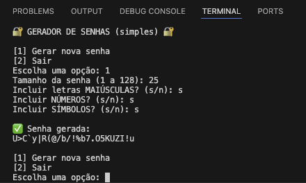

# 🔑 Gerador de Senhas (simples)


Um gerador de senhas simples feito em **Python** para praticar programação e versionamento com **Git/GitHub**.
---

## ⚙️ Funcionalidades
- Escolher o **tamanho da senha** (1 até 128 caracteres).  
- Incluir ou não **letras maiúsculas**.  
- Incluir ou não **números**.  
- Incluir ou não **símbolos especiais**.  
- Geração rápida e simples pelo terminal.  

---

## 🚀 Como usar

1. Clone este repositório:
   ```bash
   git clone https://github.com/myhtorres/password-generator-myrelle.git

2. Acesse a pasta do projeto:
   cd password-generator-myrelle

3. Execute o script:
   python3 password_generator.py

4. Escolha as opções no menu para gerar sua senha.


📂 Estrutura do projeto

password-generator-myrelle
├── password_generator.py   # Código principal do gerador
├── .gitignore              # Arquivos ignorados pelo Git
├── README.md               # Documentação do projeto
└── screenshot.png          # Exemplo de execução


    💻 Exemplo de execução



📚 Aprendizados
Praticar Git e GitHub (commits, push, README, .gitignore).
Uso de Python para criar um programa funcional.
Inserir prints e documentação em Markdown para deixar o projeto mais completo.

📝 Licença

Este projeto é open-source e pode ser usado livremente para estudos e melhorias. 😉

Feito por Myrelle Torres.


